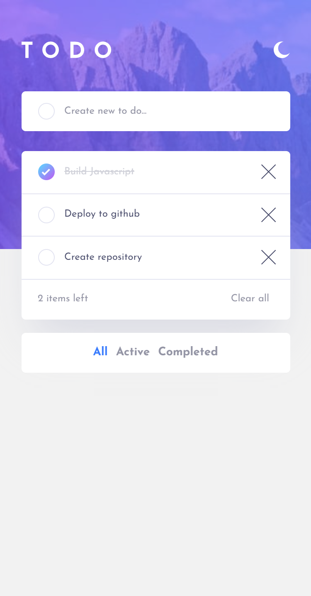

# Frontend Mentor - Todo app solution

This is a solution to the [Todo app challenge on Frontend Mentor](https://www.frontendmentor.io/challenges/todo-app-Su1_KokOW). Frontend Mentor challenges help you improve your coding skills by building realistic projects.

## Table of contents

- [Frontend Mentor - Todo app solution](#frontend-mentor---todo-app-solution)
  - [Table of contents](#table-of-contents)
  - [Overview](#overview)
    - [The challenge](#the-challenge)
    - [Screenshot](#screenshot)
    - [Links](#links)
  - [My process](#my-process)
    - [Built with](#built-with)
    - [What I learned](#what-i-learned)
    - [Continued development](#continued-development)
    - [Useful resources](#useful-resources)
  - [Author](#author)

## Overview

### The challenge

Users should be able to:

- View the optimal layout for the app depending on their device's screen size
- See hover states for all interactive elements on the page
- Add new todos to the list
- Mark todos as complete
- Delete todos from the list
- Filter by all/active/complete todos
- Clear all completed todos
- Toggle light and dark mode
- Data persistance through LocalStorage

### Screenshot



### Links

- Solution URL: [GitHub Repository](https://github.com/hec-lopz/todo-app)
- Live Site URL: [Live site](https://heclopz-todo-app.netlify.app/)

## My process

### Built with

- Semantic HTML5 markup
- CSS custom properties
- Flexbox
- Mobile-first workflow
- [React](https://reactjs.org/) - JS library
- [Styled Components](https://styled-components.com/) - For styles

### What I learned

I used this project to practice React Hooks and Styled-Components, it blew my mind how easy it was to modify styles based on a variable.

At the beginning I wasn't sure about how to create the effect of hovering the checkbox. When you do that it's supposed to show a gradient in the border. I took advantage of the css pseudo-classes `::before` and `::after`; I created a container with a grayish background and put a smaller circle within that has the same color as the container of the list item. The tick is the same color as the smaller circle, so when you check the box it scales down to 0 and you can see both the tick and the gradient.

This code is in [./src/styles/ListItemStyles.js](./src/styles/ListItemStyles.js)

```js
const CheckButton = styled.input.attrs((props) => ({
  type: "checkbox",
}))`
  appearance: none;
  background: ${(props) =>
    props.theme.listItem.border}; //This is the grayish color
  border-radius: 50%;
  position: relative;

  //Inner circle
  &::before {
    content: "";
    width: 90%;
    height: 90%;
    background: ${(props) =>
      props.theme.listItem
        .background}; // This is the same color as the list item background
    border-radius: 50%;
    position: relative;
    z-index: 2;
  }

  // This is the container of the tick
  &::after {
    content: "";
    background-image: url("/images/icon-check.svg");
    background-repeat: no-repeat;
    background-position: center;
    position: absolute;
    width: 90%;
    height: 90%;
  }
  //Styles when the checkbox is checked
  &:checked {
    background: ${(props) =>
      props.theme.colors.gradient}; //This is the gradient
    &::before {
      transform: scale(0);
    }
  }

  // This is used for the hovering effect only on Desktops.
  @media screen and (min-width: 1200px) {
    &:hover {
      background: ${(props) => props.theme.colors.gradient};
    }
  }
`;
```

I also learned how to implement local storage by stringifying an object to save it and then parse it when fetching it.

### Continued development

I would like to improve the organization of my files as I feel that it could've been better.

I want to implement possibility of organizing the item by Drag and Drop.

### Useful resources

- [The 100% correct way to do CSS breakpoints](https://medium.com/free-code-camp/the-100-correct-way-to-do-css-breakpoints-88d6a5ba1862) - This helped me to decide what viewports I should use, I'm referring to this article for all my projects
- [How to Write a Git Commit Message](https://chris.beams.io/posts/git-commit/) - This article helped me to write better commits. I didn't use it very much in this specific project, but I kept it in mind when doing most of my commits.
- [Pure CSS Custom Checkbox Style](https://moderncss.dev/pure-css-custom-checkbox-style/) - I used this article to customize the styles of my inputs, both radio and checkboxes.

## Author

- Website - [hec_lopz portfolio](https://www.heclopz.com)
- Frontend Mentor - [@hec-lopz](https://www.frontendmentor.io/profile/hec-lopz)
- Twitter - [@hec_lopz](https://www.twitter.com/hec_lopz)
